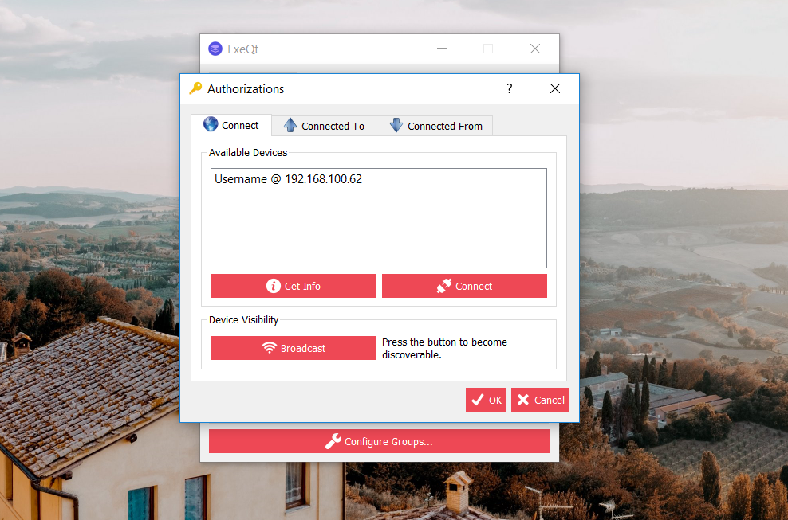
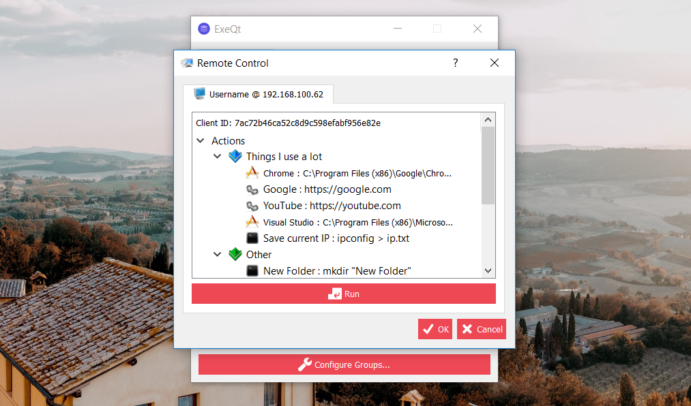

# ExeQt

## What is it?
A nifty little utility for pinning commands, applications or links to the system tray. ExeQt goes even further and provides network facilities so that your custom actions can be transfered, accesed and used from computers around the world or computers around your house.

## How does it work?
ExeQt uses the system's native tray to display groups of actions with the things you love most such documents, pictures and even websites. Actions are cool little shortcut-like items that make your life easier. Anything you can run or execute on your machine can be put in one convenient menu that you can acces anywhere on your operating system.

## Features
- Ability to create shortcuts for shell commands, executable files, web links or any other file on the system
- Nice grouping of actions so the system tray is kept neat and tidy
- Support for action sets which make running multiple things together really easy by grouping the existing actions
- Actions that save locally in an XML format
- Cross platform (Windows, macOS and Linux) thanks to the cross platform Qt Toolkit
- Actions can be synced across computers using a free cloud service that is provided for the app
- Communication with other computers in LAN running ExeQt allows you to call actions on another computer in your house or office remotely from the comfort of your computer

## User interface
Easy to work with, featuring an easy to use user interface for manging your actions

One intuitive application menu!

The web platform from where you can log in to your account and keep actions synced across computers

An account for every user.

Accessing other computers on the LAN

Running actions on another computer on the LAN

## Upcoming Features
- [ ] Start minimised
- [ ] Executable icon
- [ ] Application installer
- [x] Tooltips
- [x] Keyboard shortcuts
- [x] Merge dialog
- [ ] Unique session ID for cloud syncs
- [ ] Parameters for user input
- [ ] User input for command actions
- [ ] Working directory setting for commands
- [ ] Scheduled execution
- [ ] Restricted acces for certain groups when using the remote control feature
- [ ] A better algorithm for password hashing
- [ ] Better web API

## Installation
The latest version of ExeQt can be found on the [Releases](https://github.com/AlexandruIstrate/ExeQt/releases) page.

## Building from Source

You must first have one of the C++ compilers (Qt pretty much supports all compilers including MSVC, GCC and MinGW) and the Qt Toolkit installed on your machine

- **Windows:** The project must be first built using the QtCreator IDE and then if you want to create a standalone executable you must use the tool [windeployqt](https://doc.qt.io/qt-5/windows-deployment.html) which creates a directory with your app and all of the required DLLs so that you can run ExeQt on a system without having Qt installed

- **macOS:** The project must be first built using the qMake script (or the QtCreator IDE) and then if you want to create a standalone executable you must use the tool [macdeployqt](https://doc.qt.io/qt-5/osx-deployment.html#macdeploy) which creates an App Bundle so that you can run ExeQt on a system without having Qt installed

- **Linux:** The project must be first built using the qMake script (or the QtCreator IDE) and then if you want to create a standalone executable you must use the tool [linuxdeployqt](https://github.com/probonopd/linuxdeployqt) which creates an AppImage so that you can run ExeQt on a system without having Qt installed

## Libraries used
- [Qt Toolkit](https://www.qt.io/)
- [qtsingleapplication](https://github.com/qtproject/qt-solutions/tree/master/qtsingleapplication) from the [qt-solutions](https://github.com/qtproject/qt-solutions) project

## Contributing
If you would like to help this project grow, I would really appreciate it. Generaly the things that need help will be listed as issues. However if you have a good idea, nobody says it can't make it into the project!

## Disclaimer
I do not own any of the icons used in this project. I thank the wonderful people at [findicons.com](findicons.com), [iconarchive.com](iconarchive.com) and [Icons8](icons8.com) for making these available to the public for free.
My thanks to the person that took the picture I used for my desktop background.
Also on the list of things not entirely made by me is the nice ExeQt WordArt that I used as the picture at the top of this page. That image was made with a free tool from [WordArt.com](https://wordart.com/)
